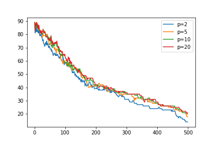
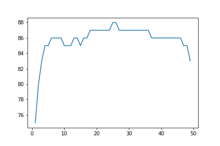
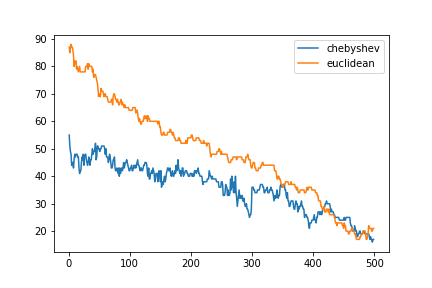
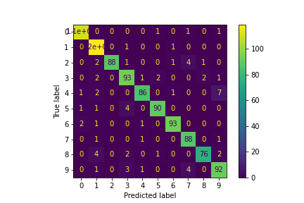
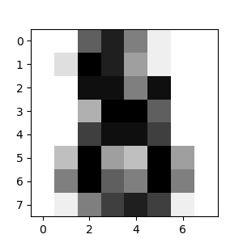
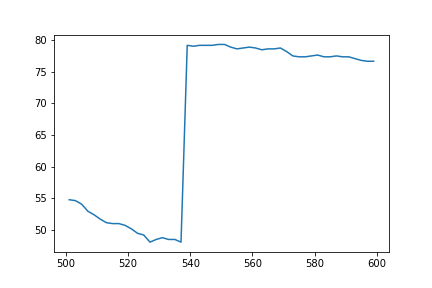

# 华中科技大学机器学习 KNN-MNIST实验 #

本实验使用MNIST数据集作为训练集和验证集，实现了基于KNN算法的手写数字识别算法。

开发环境为Spyder+Jupyterbook，在Spyder开发环境下实现了基于Python3的KNN算法，之后在Google Cloud Platform上搭建了Jupyterbook服务器，并在Jupyterbook上实现了基于sklearn的KNN算法。

前往[Jupyterbook](http://35.201.136.176:8888/)

接下来简单总结本次实验的成果

### 1. 使用Python3实现的KNN算法和使用sklearn实现的KNN算法的效率比较 ###
在p=2， k=5， 验证集大小为10000，训练集大小为60000的条件下，使用Python3实现的KNN算法进行一次完整的预测耗时为1小时31分28秒，使用sklearn实现的KNN算法进行一次完整预测的耗时为19分26秒。sklearn实现的效率约为Python3的4.5倍。

在查阅了sklearn的官方手册之后，了解到sklearn的KNN算法实现使用了便于排序和查找的数据结构，而我自己实现KNN算法则是简单的使用矩阵储存距离，使用numpy的排序算法，这导致了两者巨大的效率差异，因为sklearn实现的效率较高，所以我之后主要使用sklearn实现的KNN算法。

### 2. 不同K值对结果的影响 ###
在p=2, 5, 10, 20，验证集大小为100，训练集大小为600的条件下，对k在[1, 500]范围内的各个取值进行预测，并使用matplotlib绘制出准确率与k的曲线，得到图像如下

由图像可知，随着k值的增大，准确率首先快速的上升，在k为[3, 5]范围内达到一个峰值，之后随着k的增大，准确率逐渐下降。在k接近训练集大小时，准确率降低为10%左右，此时KNN算法完全没有意义。无论p的取值为多少，准确率随k的变化趋势都没有改变。从这张图也可以看出小范围内p取值的变化对于结果的影响并不大。

### 3. 不同p值对结果的影响 ###
在k=5， 验证集大小为100，训练集大小为600的条件下，对p在[1, 50]的范围内的各个取值进行预测，并使用matplotlib绘制出准确率与p的曲线，得到图像如下

可见在k值相同的情下。p的取值对准确率的影响不大，在3%以内。在k=5时，取p=25,26准确率最高。通过结合k值对准确率影响的研究，可以确定在小范围内p的变化对准确率的影响较小。

### 4. 切比雪夫距离下KNN算法的准确度 ###
经过之前的研究的得到了小范围内p值变化对结果影响较小的结论，接下来研究当p趋近于无穷大，使用切比雪夫距离计算时结果如何。

在k=5，验证集大小100，训练集大小600的条件下，分别使用欧氏距离和切比雪夫距离，对k在[1, 500]范围的每一个进行预测，并使用matplotlib绘制出准确率曲线，得到图像如下

当使用切比雪夫距离时，准确率明显下降了，随着k值的上升，两种距离计算方式的差距越来越小。出现这种现象的原因，个人推测在于切比雪夫距离取的是各个坐标差的最大值，体现在MNIST数据集上就是两张图片间只要有一个像素点的灰度差距过大，两者在计算时的距离就会很大，而这显然是不利于手写数字识别的。因此切比雪夫距离的效果要远远差于欧式距离。

### 5. 不同数字预测效果 ###
在p=2，k=5， 验证集大小100，测试集大小600的条件下进行一次预测，并打印出混淆矩阵，得到图像如下

从图中可以看出数字2容易被误认为数字7，数字5容易被误认为数字3，数字4容易被误认为数字9，这些都很符合我们平时生活中的情况，而且通过混淆矩阵也可以发现，KNN算法对于各个数字预测的准确率都是相当高的。
### 6. 在使用其他数据集时发现的异常及其可能解释 ###
在与ACM班师宇哲同学的讨论中，发现在使用[Optical Recognition of Handwritten Digits Data Set](https://archive.ics.uci.edu/ml/datasets/Optical+Recognition+of+Handwritten+Digits)作为数据集时，会在k为训练集大小一半左右的时候产生一个准确率的突变，准确率会突然提升最多30%，然后再迅速下降。
此数据集为sklearn自带的digits数据集，数据集中共有1797张8*8大小的手写数字图像，每个像素使用0~16的整数来表示其灰度值，示例如下

对这个数据集进行一次预测，得到k与准确率的曲线如下

这里取切比雪夫距离，训练集大小为1000，k=540处左右出现了准确率的突变。经过反复试验，无论训练集大小的取值如何，总会出现这个现象。再仔细观察数据集的特征后，不难看出由于数据集的维度很小，导致数字的特征并不能很好的被表示出来。在KNN算法下，假设距离相近的点类别也相同，但是在数据集维度很小，加之没有对图像进行二值化，导致图像之间的距离并不能表征数字类别的关系，KNN的假设在k值增大到训练集的一半后，由于噪声的影响过大，已经难以成立，导致预测结果出现十分诡异的突变现象。但是在k值较小的情况下，切比雪夫距离在维度较低的数据集上仍有很好的表现，准确率可以达到95%左右。

通过这个研究也警示了我们，对于不同的数据集要选用不同的算法以及参数，才能得到理想的学习效果。